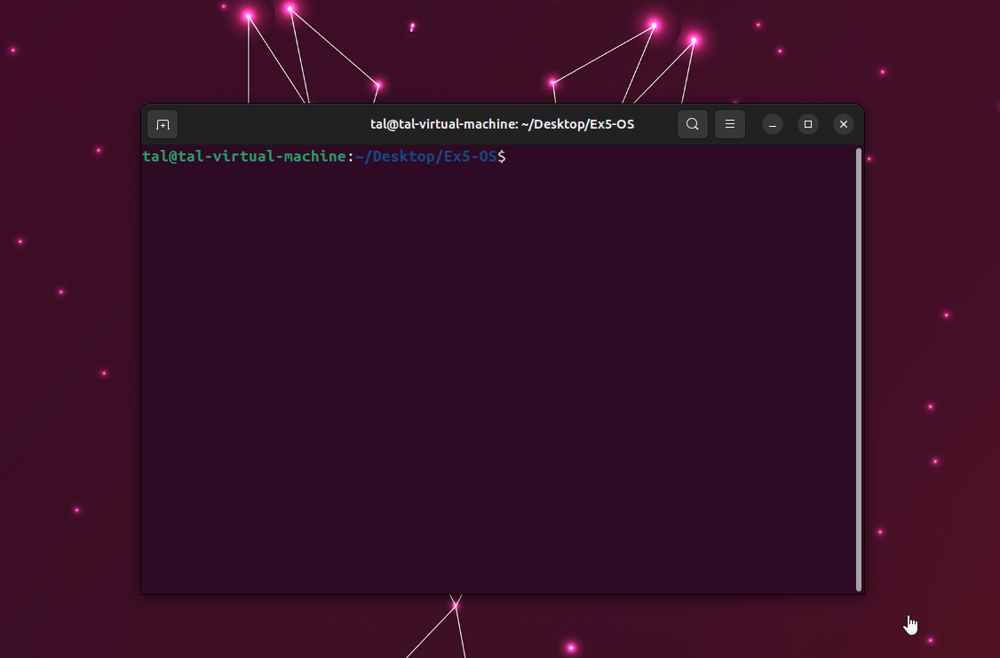

# st_pipeline

st_pipeline is a C application that implements a pipeline processing system using the Active Object pattern. The program creates four active objects that perform different operations on random numbers. The operations include checking if a number is prime, adding 11, subtracting 13, and adding 2. The numbers are passed between the active objects in a pipeline fashion.

## Prerequisites

To compile and run the st_pipeline application, you need to have `gcc` installed on your machine.

## Source Files

- `Prime.c` and `Prime.h`: Contains functions for prime number checking.
- `Queue.c` and `Queue.h`: Implements a thread-safe queue data structure for task management.
- `ActiveObject.c` and `ActiveObject.h`: Implements the Active Object pattern with a dedicated thread for task processing.
- `st_pipeline.c` and `st_pipeline.h`: The main application that creates four active objects and passes random numbers between them.

## Compilation

To compile the source code, navigate to the directory containing the source files and the Makefile using the terminal, and then execute the following command:

```
$ cd /path/to/source/files
$ make
```

This command will compile the source files and create an executable named `st_pipeline`.

## Execution

To execute the st_pipeline program, use the following command in the terminal:

```
$ ./st_pipeline <num_of_tasks> <random_seed>
```

Replace `<num_of_tasks>` with the desired number of tasks to be processed. Optionally, you can provide a `<random_seed>` for the random number generator.

## Explanation

The st_pipeline program utilizes the Active Object pattern and a thread-safe queue data structure to process tasks. It creates four active objects, each representing a stage in the pipeline. When executed, the program generates `<num_of_tasks>` random numbers and passes them between the active objects for processing.

The active objects perform specific operations on the numbers, including prime number checking, addition of 11, subtraction of 13, and addition of 2. The tasks are executed in a controlled order using the queue data structure. The program ensures thread safety using mutexes.

The program terminates when all tasks have been processed by the active objects.


